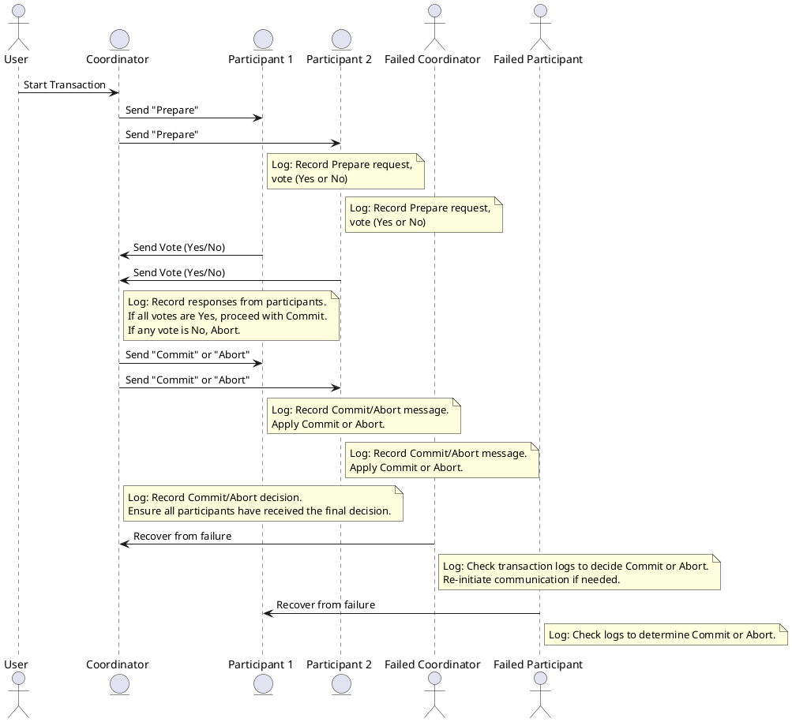

# 2 phase commit

### Explanation of the Diagram:
- **Coordinator**: The central entity that orchestrates the 2PC process. It sends "prepare" requests to participants, collects votes, and then sends the final "commit" or "abort" decision.
- **Participants (P1, P2)**: These are the nodes that hold the data and participate in the transaction. They vote on whether they can commit or need to abort based on their state.
- **Log**: Each entity (Coordinator, Participants) maintains a log for transaction recovery in case of failures.
  - Logs are used to record the actions taken (such as receiving the "prepare" request, voting, and committing/aborting). In case of a failure, the logs help the system recover to a consistent state.

### Notes:
- **Participant logs**: They store actions related to the transaction, including whether they voted "Yes" or "No" and whether the transaction was committed or aborted.
- **Coordinator log**: It records the votes received from the participants and the final decision (commit or abort).
- **Recovery**: If the coordinator or a participant fails during the process, upon recovery, they check their respective logs to determine the transaction's final outcome (commit or abort) and re-initiate the necessary communication.

This diagram represents the sequence of actions and how logs are used to ensure atomicity and consistency in distributed systems with 2PC.