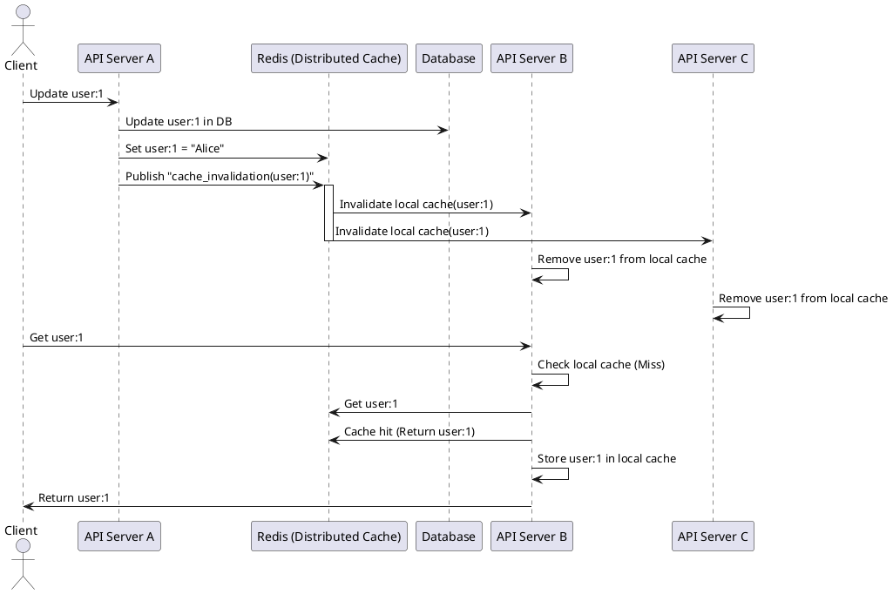

# Thundering herd (Cache stampede)
- Happens when multiple requests try to fetch the same missing (evicted/expired) cache entry simultaneously.
- This can overload the backend database or service as many requests hit it at once.
- Mitigation: Use techniques like lock-based caching, request coalescing, or staggered expiration (randomized TTLs).

## Visualization


## Prevention

```python
import threading
import time
import functools

# Our cache and locks
cache = {}
cache_locks = {}

def cached_function(key, expensive_operation):
    # ... (code from the repository) ...

# Example expensive operation
def _expensive_calculation(x):
    print(f"Calculating for {x}...")
    time.sleep(2)
    return x * 2

# Make the expensive function cached
expensive_calculation = cached_function("my_key", _expensive_calculation)

# Simulate concurrent requests
threads = []
for _ in range(5):
    t = threading.Thread(target=lambda: print(expensive_calculation(5)))
    threads.append(t)
    t.start()

for t in threads:
    t.join()

print(cache)

# Example with different keys
expensive_calculation_2 = cached_function("my_key_2", _expensive_calculation)
print(expensive_calculation_2(10))
print(cache)
```

### Why should I preserve key within the map?


# Solving cache inconsistency


Here's a detailed write-up on **Pub/Sub Cache Invalidation for Local + Distributed Cache**:

---

# **Pub/Sub Cache Invalidation for Local + Distributed Cache**

## **Introduction**
When using both a **local cache** (in-memory) and a **distributed cache** (like Redis) in a REST API, keeping them synchronized can be challenging. Updates on one server may not immediately propagate to others, leading to stale data.  

To solve this, we use **Redis Pub/Sub** to broadcast cache invalidation messages, ensuring all instances clear stale data efficiently.

---

## **Challenges with Local + Distributed Caching**
1. **Cache Inconsistency**  
   - A server updates the database and distributed cache, but other API servers still serve stale data from their local cache.

2. **Cache Staleness**  
   - Local caches do not automatically know when data changes elsewhere.

3. **Performance vs. Consistency Trade-off**  
   - Local caches improve performance but require a mechanism to stay in sync.

---

## **Solution: Redis Pub/Sub for Cache Invalidation**
### **How It Works**
1. **Write Operation (Update/Delete)**
   - API updates the database.
   - API updates the distributed cache (Redis).
   - API publishes an **invalidation event** (key) to a Redis channel.

2. **Read Operation**
   - API first checks the **local cache**.
   - If a **cache miss** occurs, fetch from Redis and update the local cache.

3. **Cache Invalidation**
   - All API instances **subscribe to Redis Pub/Sub**.
   - When an update occurs, they receive a notification and remove the stale key from their local cache.

---

## **Sequence Diagram**
The following PlantUML diagram represents the flow:



### **Flow Explanation**
1. **Client updates data** → API Server A updates the database and Redis.  
2. **API Server A publishes an invalidation event** → Redis notifies other API servers.  
3. **API Servers B & C receive the event** → They clear the stale data from their local caches.  
4. **Client requests the updated data from Server B**  
   - Local cache **miss** → Fetch from Redis → Update local cache → Return fresh data.  

---

## **Implementation in Python**
### **1️⃣ Writing Data & Publishing Invalidation Event**
```python
import redis

# Redis connection
redis_client = redis.Redis(host="localhost", port=6379, decode_responses=True)

# Local cache (in-memory)
local_cache = {}

def update_data(key, value):
    """Update data, invalidate cache, and notify other API instances."""
    # Simulate DB update (replace with actual DB logic)
    print(f"Updating DB: {key} -> {value}")

    # Update Redis (distributed cache)
    redis_client.set(key, value)

    # Invalidate local cache
    local_cache.pop(key, None)

    # Publish cache invalidation event
    redis_client.publish("cache_invalidation", key)
```
✅ Updates **DB and Redis**  
✅ **Removes local cache entry**  
✅ **Notifies other API servers via Pub/Sub**  

---

### **2️⃣ Listening for Cache Invalidation Events**
Each API instance listens to invalidation messages and removes stale data.

```python
import threading

def listen_for_invalidation():
    """Subscribe to cache invalidation events and remove stale local cache keys."""
    pubsub = redis_client.pubsub()
    pubsub.subscribe("cache_invalidation")

    print("Listening for cache invalidation events...")

    for message in pubsub.listen():
        if message["type"] == "message":
            key = message["data"]
            print(f"Invalidating local cache for key: {key}")
            local_cache.pop(key, None)  # Remove from local cache

# Run the listener in a separate thread
thread = threading.Thread(target=listen_for_invalidation, daemon=True)
thread.start()
```
✅ Each API instance **listens for invalidation events**  
✅ On receiving a message, it **removes stale data from local cache**  

---

### **3️⃣ Reading Data Efficiently**
```python
def get_data(key):
    """Retrieve data with local + distributed caching."""
    # Check local cache first
    if key in local_cache:
        print(f"Local cache hit: {key}")
        return local_cache[key]

    print(f"Local cache miss: {key}. Fetching from Redis...")
    
    # Check Redis
    value = redis_client.get(key)
    if value:
        local_cache[key] = value  # Update local cache
        return value

    # If not found in Redis, fetch from DB (simulate)
    value = fetch_from_db(key)
    if value:
        redis_client.set(key, value)  # Update distributed cache
        local_cache[key] = value      # Update local cache
    return value

def fetch_from_db(key):
    """Simulated database fetch"""
    print(f"Fetching {key} from DB...")
    db_data = {"user:1": "Alice", "user:2": "Bob"}  # Example data
    return db_data.get(key)
```
✅ **Fast reads** from local cache when available  
✅ **Falls back to Redis or DB** when necessary  

---

## **Advantages of Pub/Sub Cache Invalidation**
✅ **Real-time cache invalidation** → Keeps all API servers in sync  
✅ **Minimizes database load** → Most reads hit **local cache or Redis**  
✅ **Low latency** → No need to wait for TTL expiration  
✅ **Scalable** → Works well with **multiple API instances**

## **Potential Enhancements**
1. **Batch Invalidation**  
   - Instead of publishing one key at a time, send multiple keys in one message.  

2. **Hierarchical Cache Invalidation**  
   - If updating a **user profile**, also invalidate related **posts/comments**.  

3. **Use a Message Queue (if needed)**  
   - If Redis Pub/Sub is unreliable, use **Kafka, RabbitMQ, or AWS SNS/SQS**.

## **Conclusion**
Redis Pub/Sub is a **simple, effective, and scalable** approach to ensure consistency between **local and distributed caches** in a REST API.  


